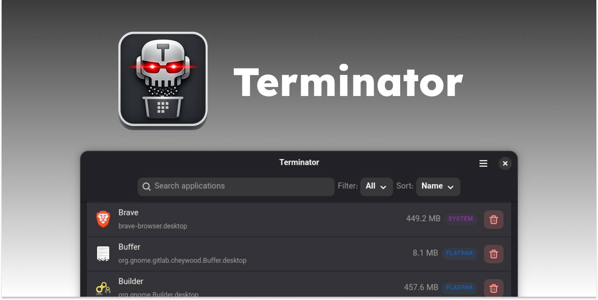

A simple but powerful tool for managing installed applications on your linux machine. Whether you installed an app through your system's package manager, Flatpak, or Snap, Terminator provides a unified interface to view and remove them all from one place.

## Features

- Browse installed applications with their icons and identifiers
- See per-app disk usage and sort the list by name or size to spot what's taking up space
- Remove system packages, AppImages, Flatpaks, and Snaps from the same interface
- Confirmation and authentication dialogs prevent accidental uninstallations
- Search and filter installed apps by name or type

## Supported Package Types

- System packages
- User-local packages
- Flatpak
- Snap
- AppImage

## Installation

### Arch Linux (AUR)

```bash
yay -S app-terminator
```

Or with any other AUR helper (`paru`, `pikaur`, etc.).

### Fedora

```bash
# add the repository for Terminator
sudo dnf config-manager addrepo --from-repofile=https://download.opensuse.org/repositories/home:/r6mez/Fedora_$(rpm -E %fedora)_standard/home:r6mez.repo

# install the app-terminator package
sudo dnf install app-terminator
```

### Ubuntu / Pop!_OS / Mint / Zorin OS

```bash
# add the repository for Terminator
sudo add-apt-repository ppa:r6mez/app-terminator

# update the package list
sudo apt update

# install the app-terminator package
sudo apt install app-terminator
```

### Debian

Download the latest `.deb` from the [releases page](https://github.com/r6mez/App-Terminator/releases/latest) and install it:

```bash
# downloads the latest .deb file from the releases page
wget https://github.com/r6mez/App-Terminator/releases/latest/download/app-terminator_0.2.0-1~noble1_all.deb

# install the downloaded .deb file
sudo apt install ./app-terminator_0.2.0-1~noble1_all.deb
```
<!-- I expected the app-terminator package executable to be ``app-terminator`` but i had to extract the rpm just to find out its ``org.ramez.terminator`` so i added this line for users who don't the executable -->
#### Run App Terminate:
```bash
org.ramez.terminator
```
## License

Terminator is free software released under the [GNU General Public License v3.0](COPYING) or later.

## Contributing

Contributions are welcome! Feel free to open issues or submit pull requests. See [CONTRIBUTING.md](CONTRIBUTING.md) for build instructions.
